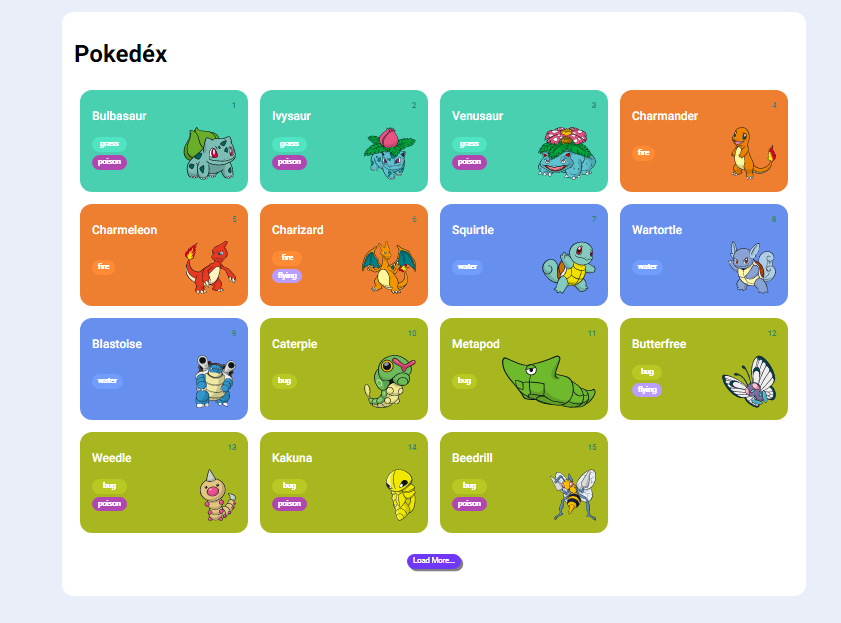
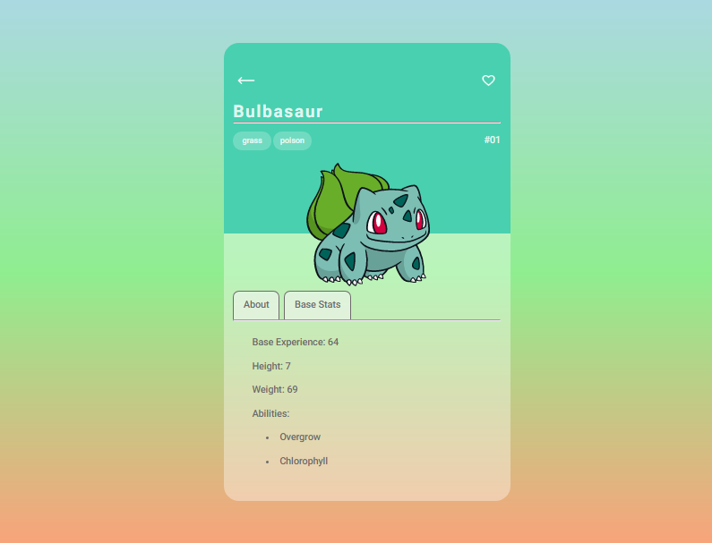

# Pokedex 👾

> NTT Data Diversidade em Tech - DIO.me 👩‍💻

- Página principal:

- Cards 

- Como deveria ser:
[Assita o vídeo de como ficou...👈](https://youtu.be/eOWsumVSWMM)

Projeto para explorar o mundo Pokémon através do consumo de uma API REST para a criação de uma Pokédex incrível! 
Além disso, exploramos todos os fundamentos de desenvolvimento Web aprendidos até aqui.

[Clique aqui para acessar a página!!👈](https://tiemi9.github.io/DIO-NTTData-Pokedex/)

## 📡 Tecnologias

    - HTML,
    - CSS,
    - JavaScript,
    -  Git e GitHub 

##  💻 Contato

https://www.linkedin.com/in/cristiemim9

### 🎉 Agradecimentos 
À toda equipe da DIO.me, e principalmete ao Renan Johannsen e "Lemaozito" que nos acompanharam durante essa jornada, partilhando dúvidas e enriquecendo o aprendizado. Obrigada pessoal... E bora... codar e decolar! 🚀